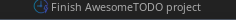
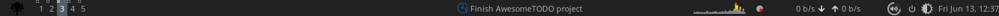
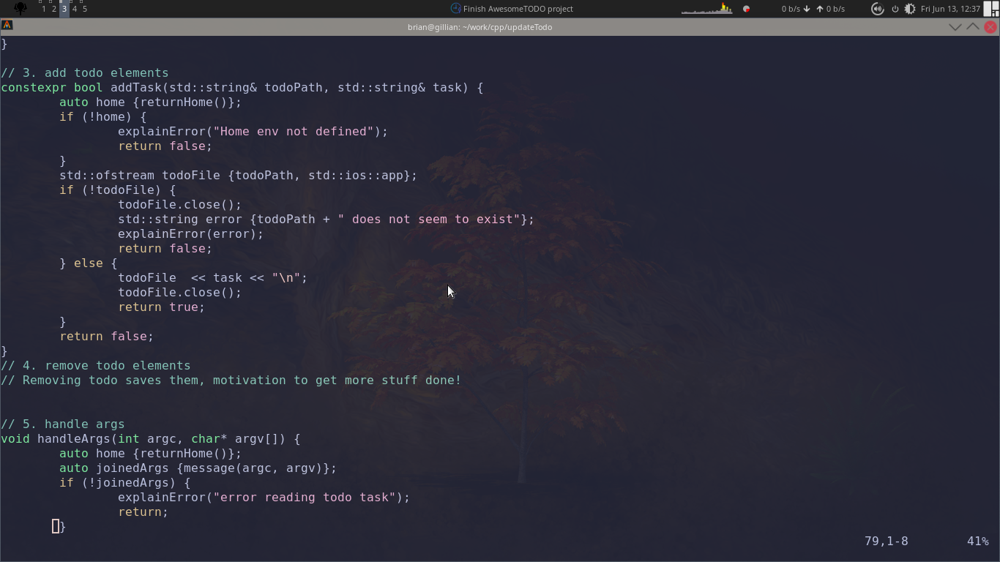

Simple TODO that will:  
 - Records items and removes them
 - Records done items (Motivation to get things done!)
 - 'Alarm system' that reminds you of work to be done
 - Reminds one also to set items to be done.

Will use it in Awesome window manager to display the tasks, one at a time.

-----------------
Awesome WM shows the items in the winbar, but anywhere works!  
Awesome's WM rc.lua would look smth like:
<pre>
-- Create the textbox widget
local todo_widget = wibox.widget.textbox()

-- Function to update the todo list
local function update_todo_list()
    local f = io.open(todo_file, "r")
    local todo_content = ""
    local has_items = false;

    if f then
        local lines = {};
        for line in f:lines() do
            --todo_content = todo_content .. line .. "\n"
            table.insert(lines, line)
        end
        f:close()
        if #lines > 0 then
            has_items = true
            todo_content = table.concat(lines, "\n")
        else
            todo_content = "No pending task"
        end
    else
        todo_content = "No todo file found!"
    end

    local current_time = os.date("*t")
    if has_items and (current_time.hour > CRITICAL_HR or (current_time.hour == CRITICAL_HR and current_time.min >= CRITICAL_MIN)) then 
        todo_widget.markup = '' .. todo_content .. ''
    else
        todo_widget.text = todo_content
    end
end

-- Initial update
update_todo_list()

-- Set up a timer to update the todo list periodically
gears.timer {
    timeout = 60, -- Update every 60 seconds
    call_now = false,
    autostart = true,
    callback = function() update_todo_list() end
}

  -- call the widget in s.mywibox:setup block
</pre>

------------------------------------------------
Currently, have this:  
***Active TODO items***  

***Winbar***  

***Whole screen***  
